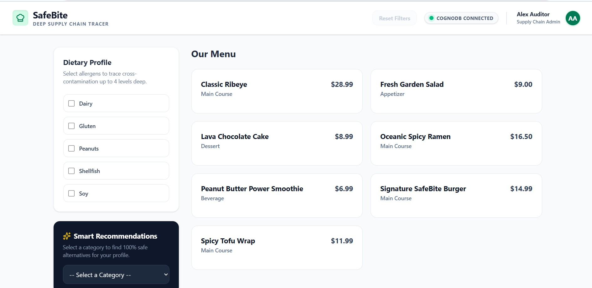
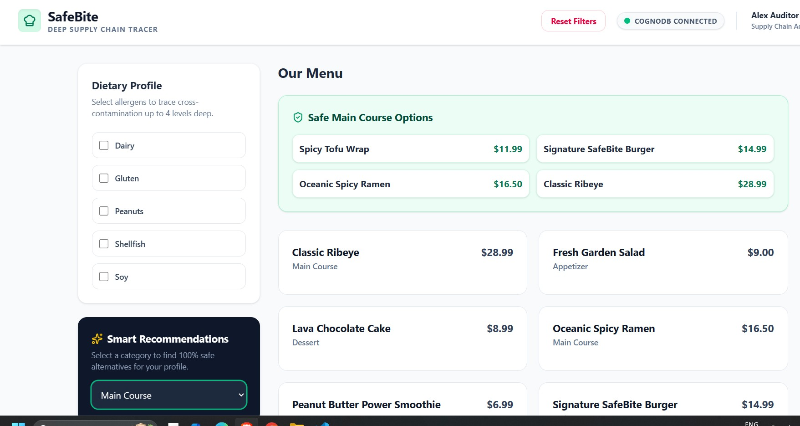
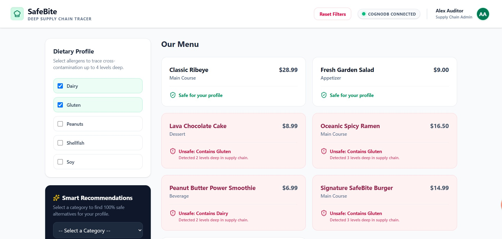

# 🍔 SafeBite — Deep Supply Chain & Allergen Tracer

SafeBite is a graph-based food supply-chain and allergen tracing application built for the **WEXA AI CognoDB assignment**.

It models relationships between menu items, ingredients, allergens, suppliers, and facilities to detect hidden allergens and trace their source across multiple levels of the supply chain.

### 🌐 Live Demo

**Frontend:** https://safebite-rontend.onrender.com/

**Backend API:** https://safebite-backend-lri4.onrender.com/api/safebite

---

## 🧠 Problem

Food allergens are not always present in a menu item's direct ingredients.

For example:

```text
SafeBite Burger
      │
      ▼
Secret Sauce
      │
      ▼
Base Paste
      │
      ▼
Peanuts
```

A simple lookup of the burger's direct ingredients would miss the peanut.

SafeBite solves this by representing the complete ingredient and supply-chain structure as a graph and traversing the relationships to discover hidden allergens.

---

## 🕸️ Why a Graph Database?

This problem is fundamentally about **connections and relationships**, making it a natural fit for a graph database.

In a relational database, finding an allergen several levels deep would require recursive queries and repeated joins.

For example, determining whether a menu item contains an allergen somewhere in an unknown ingredient hierarchy can require a recursive CTE.

With a graph database, the same operation can be expressed naturally using a variable-length relationship:

```cypher
MATCH path =
(m:MenuItem)-[:CONTAINS*1..4]->(i:Ingredient)
-[:HAS_ALLERGEN]->(a:Allergen)
WHERE a.name IN $allergens
RETURN DISTINCT m, path
```

The graph approach makes multi-hop relationship traversal explicit and keeps the query focused on the actual structure of the data.

---

# 🧩 Graph Data Model

### Nodes

* `MenuItem` — final dishes sold to customers
* `Ingredient` — direct and nested ingredients
* `Allergen` — allergens such as peanuts or dairy
* `Supplier` — companies providing ingredients
* `Facility` — facilities operated by suppliers

### Relationships

```text
(MenuItem)-[:CONTAINS]->(Ingredient)

(Ingredient)-[:CONTAINS]->(Ingredient)

(Ingredient)-[:HAS_ALLERGEN]->(Allergen)

(Ingredient)-[:SOURCED_FROM]->(Supplier)

(Supplier)-[:OPERATES_IN]->(Facility)
```

## 🌱 Seed Data

The graph is initialized using the Cypher seed script:

`backend/src/main/resources/seed.cypher`

The script creates realistic supply-chain data including:

- Menu items
- Intermediate and base ingredients
- Allergens with severity levels
- Suppliers
- Processing facilities
- Ingredient-to-ingredient relationships
- Ingredient-to-allergen relationships
- Ingredient-to-supplier relationships
- Supplier-to-facility relationships

Example graph path created by the seed data:

```text
Signature SafeBite Burger
        ↓ CONTAINS
House Secret Sauce
        ↓ CONTAINS
Peanut Oil
        ↓ HAS_ALLERGEN
Peanuts (High)

### Graph Overview

```text
                  ┌─────────────┐
                  │  Allergen   │
                  │   Peanut    │
                  └──────▲──────┘
                         │
                   HAS_ALLERGEN
                         │
                  ┌──────┴──────┐
                  │ Ingredient  │
                  │ Base Paste  │
                  └──────▲──────┘
                         │
                      CONTAINS
                         │
                  ┌──────┴──────┐
                  │ Ingredient  │
                  │Secret Sauce │
                  └──────▲──────┘
                         │
                      CONTAINS
                         │
                  ┌──────┴──────┐
                  │  MenuItem   │
                  │   Burger    │
                  └─────────────┘

Ingredient
     │
     │ SOURCED_FROM
     ▼
 Supplier
     │
     │ OPERATES_IN
     ▼
 Facility
```

---

# ✨ Features

* 🔎 Deep allergen detection
* 🧬 Multi-level ingredient tracing
* 🚨 Unsafe menu detection
* 🥗 Safe alternative recommendations
* 🏭 Facility impact analysis
* 🕸️ Variable-depth graph traversal
* 🌱 Realistic graph seed data
* 🧪 Backend service-level testing
* 🐳 Dockerized backend
* ☁️ Hosted frontend and backend

---

# 📡 API

Base URL:

```text
/api/safebite
```

| Endpoint                                      | Purpose                                        |
| --------------------------------------------- | ---------------------------------------------- |
| `GET /menu`                                   | Fetch menu items                               |
| `GET /allergens`                              | Fetch available allergens                      |
| `GET /menu/{itemName}/ingredients`            | Fetch direct ingredients                       |
| `GET /trace?item=&allergen=`                  | Trace an allergen through the ingredient graph |
| `GET /unsafe?allergens=`                      | Find menu items containing selected allergens  |
| `GET /safe-alternatives?category=&allergens=` | Find menu items without selected allergens     |
| `GET /facility-impact?facility=`              | Find menu items affected by a facility         |

---

# 🔬 Main Graph Queries

### 1. Direct Ingredient Lookup

```cypher
MATCH (m:MenuItem {name: $itemName})
      -[:CONTAINS]->
      (i:Ingredient)
RETURN i
```

This retrieves the direct ingredients of a menu item.

---

### 2. Deep Allergen Detection

```cypher
MATCH path =
(m:MenuItem)
-[:CONTAINS*1..4]->
(i:Ingredient)
-[:HAS_ALLERGEN]->
(a:Allergen)
WHERE a.name IN $allergens
RETURN DISTINCT m, path
```

This searches from 1 to 4 ingredient levels and detects allergens hidden inside nested ingredients.

---

### 3. Allergen Trace

```cypher
MATCH path =
(m:MenuItem {name: $item})
-[:CONTAINS*1..4]->
(i:Ingredient)
-[:HAS_ALLERGEN]->
(a:Allergen {name: $allergen})
RETURN path
```

This returns the path showing how an allergen reaches the menu item.

---

### 4. Safe Alternatives

```cypher
MATCH (m:MenuItem)
WHERE NOT EXISTS {
    MATCH (m)
    -[:CONTAINS*1..4]->
    (:Ingredient)
    -[:HAS_ALLERGEN]->
    (a:Allergen)
    WHERE a.name IN $allergens
}
RETURN m
```

This uses negative graph matching to find menu items without a reachable path to the selected allergens.

---

### 5. Facility Impact

```cypher
MATCH path =
(m:MenuItem)
-[:CONTAINS*1..4]->
(i:Ingredient)
-[:SOURCED_FROM]->
(s:Supplier)
-[:OPERATES_IN]->
(f:Facility {name: $facilityName})
RETURN DISTINCT m, path
```

This traces the supply chain from a facility back to affected menu items.

---

> **All Cypher queries are parameterized and values are passed separately through the official Neo4j Java Driver rather than concatenating user input into Cypher.**

---

# 🛠️ Technology Stack

### Backend

* Java 21
* Spring Boot
* Spring Web
* Official Neo4j Java Driver
* Maven

### Database

* CognoDB
* openCypher
* Bolt protocol

### Frontend

* React
* Vite
* Tailwind CSS
* Lucide React

### Deployment

* Docker
* Render

---

# 📁 Project Structure

```text
safebite/
│
├── backend/
│   ├── src/
│   │   ├── main/
│   │   │   ├── java/
│   │   │   └── resources/
│   │   │       └── seed.cypher
│   │   └── test/
│   ├── pom.xml
│   └── Dockerfile
│
├── frontend/
│   ├── src/
│   ├── package.json
│   └── vite.config.js
│
└── README.md
```

---

# 🚀 Local Setup

## Prerequisites

* JDK 21+
* Maven 3.9+
* Node.js 18+
* npm
* CognoDB account

---

## 1. Clone

```bash
git clone https://github.com/your-username/safebite.git
cd safebite
```

---

## 2. Create a CognoDB Instance

Create a free CognoDB Cloud instance from:

https://console.cognodb.com/

Create a free `c0` instance and save the generated connection details.

CognoDB provides a connection URI similar to:

```text
bolt+s://<instance-id>.databases.cognodb.cloud
```

The database username is:

```text
cognodb
```

Save the generated password securely because it is provided when the instance is created.

---

## 3. Configure Environment Variables

The application reads database credentials from environment variables.

### Linux / macOS

```bash
export NEO4J_URI="bolt+s://<instance-id>.databases.cognodb.cloud"
export NEO4J_USERNAME="cognodb"
export NEO4J_PASSWORD="your-password"
export PORT=8080
```

### Windows PowerShell

```powershell
$env:NEO4J_URI="bolt+s://<instance-id>.databases.cognodb.cloud"
$env:NEO4J_USERNAME="cognodb"
$env:NEO4J_PASSWORD="your-password"
$env:PORT="8080"
```

**Never commit database credentials to GitHub.**

---

# ☕ Run Backend

```bash
cd backend
mvn clean spring-boot:run
```

Or:

```bash
./mvnw spring-boot:run
```

On Windows:

```powershell
.\mvnw.cmd spring-boot:run
```

Backend:

```text
http://localhost:8080
```

The application automatically loads the graph seed data using:

```text
src/main/resources/seed.cypher
```

---

# ⚛️ Run Frontend

Open another terminal:

```bash
cd frontend
npm install
npm run dev
```

Frontend:

```text
http://localhost:5173
```

Configure the frontend API URL to:

```text
http://localhost:8080/api/safebite
```

For production:

```text
https://safebite-backend-lri4.onrender.com/api/safebite
```

---

# 🐳 Docker

Build the backend:

```bash
cd backend
docker build -t safebite-backend .
```

Run:

```bash
docker run -p 8080:8080 \
  -e NEO4J_URI="bolt+s://<instance-id>.databases.cognodb.cloud" \
  -e NEO4J_USERNAME="cognodb" \
  -e NEO4J_PASSWORD="your-password" \
  -e PORT=8080 \
  safebite-backend
```

---

# 🧪 Testing

Testing was performed at the **backend service layer**.

The service tests cover core graph-based functionality including:

* Menu and ingredient operations
* Allergen tracing
* Unsafe menu detection
* Safe alternatives
* Facility impact logic

The current project does not include automated frontend, controller/API, or end-to-end tests.

---

# 🛡️ Error Handling

The backend handles database/service failures and returns an appropriate error response instead of exposing database connection details to the client.

Database credentials and connection details are supplied through environment variables and are not committed to the repository.

---

# 🖥️ UI Screenshots

### Dashboard



### Smart Recomendation Detection



### Supply Chain Trace




# ☁️ Hosted Application

### Frontend

https://safebite-rontend.onrender.com/

### Backend

https://safebite-backend-lri4.onrender.com/api/safebite

The application is deployed using Docker and Render.

---

# 🔮 Future Improvements

* Authentication and role-based access
* Batch-level recall tracking
* Real-time contamination alerts
* QR-based allergen information
* Supply-chain analytics
* AI-powered risk explanations

---

# 👨‍💻 Author

**Jaswanth Siva Sai Sontineni**

Computer Science & Engineering

**Technologies:** Java • Spring Boot • React • CognoDB • Cypher • Docker

---

## ⭐ Summary

SafeBite demonstrates how a graph database can be used to model and traverse highly connected supply-chain data.

The application combines:

```text
React
  ↓
Spring Boot REST API
  ↓
Neo4j Java Driver
  ↓
CognoDB
  ↓
Cypher Graph Traversals
```

to identify hidden allergens, trace ingredient dependencies, recommend safer menu items, and analyze the impact of supplier facilities.
